# DeFragCoord

This is a simple FragCoord - Defold migration guide.

You can test your shaders in [FragCoord.xyz](https://fragcoord.xyz/) online tool by XorDev and then use them in Defold!

## Guide

The whole migration is only based on adjusting to the different naming used in FragCoord shaders (hence defines). It's not perfect, but should work with most of the shaders from there. You need to:

1. Paste this fragment on top of your Defold fragment program:

```glsl
#version 140

in mediump vec2 var_texcoord0;

out vec4 out_fragColor;

uniform mediump sampler2D texture_sampler;
uniform fs_uniforms
{
    mediump vec4 time_res_scroll;
};

#define u_time time_res_scroll.x
#define u_resolution time_res_scroll.yz
#define u_scroll time_res_scroll.w
#define fragColor out_fragColor

// ------------------------------------------------------
// Put your FragCoord.xyz shader below:
// ------------------------------------------------------
```

2. And below paste the content of the `Main` pass from FragCoord. e.g. this is a blank project:

```glsl
void main()
{
    //Normalized screen uvs [0, 1]
    vec2 uv = gl_FragCoord.xy / u_resolution;
    //Centered, fit screen coordinates
    vec2 fit = 0.5 + (gl_FragCoord.xy - 0.5 * u_resolution) / min(u_resolution.x, u_resolution.y);

    //Output for demo
    fragColor = vec4(fit, 0, 1);
}
```

3. Then, you need to provide the used uniforms to the shader. Most of the shaders need time and resolution, sometimes mouse input. If the shader from FragCoord provides custom uniforms, you would need to either provide them, or define default values (e.g. like in `the_card_game.fp` example).

Example script that provides time, resolution, mouse scroll and position is provided in `main/uniforms.script` in this repository.

## Examples

This example comes with few shaders already ported. Those are added to the sprite component. You can run it from Defold and change the material to any other one, save and Hot Reload (<kbd>Ctrl</kbd>+<kbd>R</kbd>) to quickly preview the others.

| Name | Preview |
|-|-|
| blank | 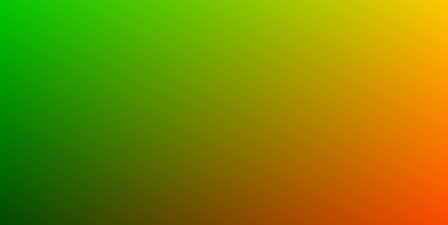 |
| cloud | 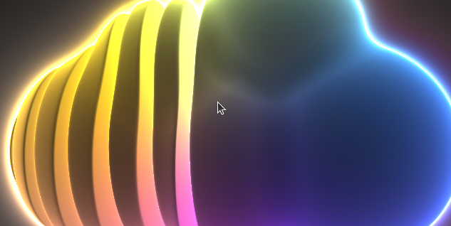 |
| corridor | 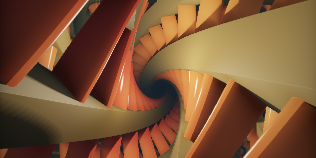 |
| dda | 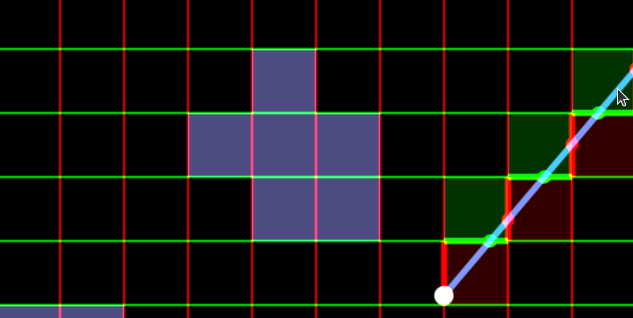 |
| dot_noise | 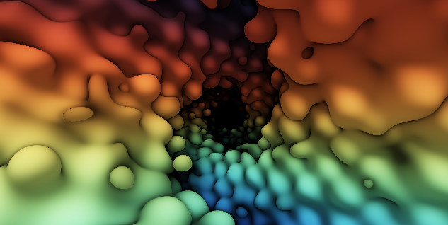 |
| four_antialiasings | 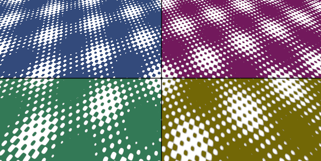 |
| light_cave | 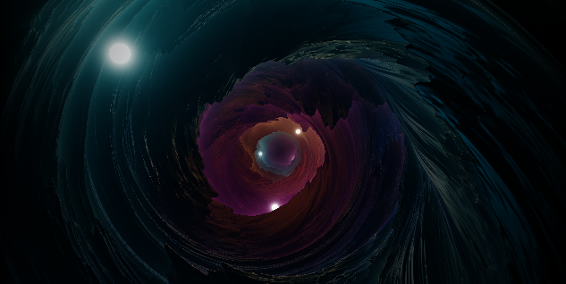 |
| nova | 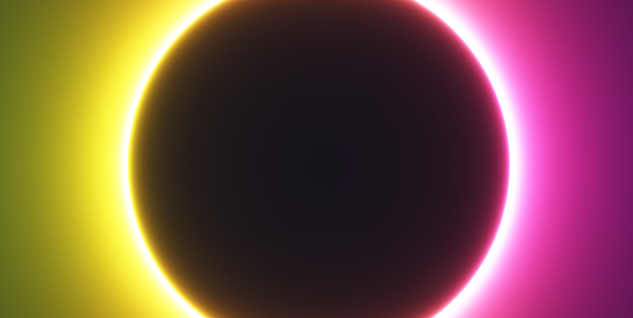 |
| pillar | 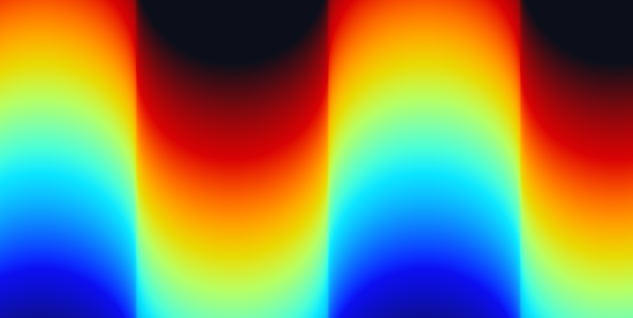 |
| sunset | 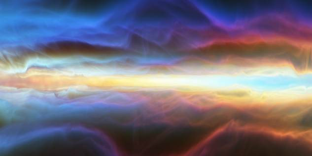 |
| the_card_game | 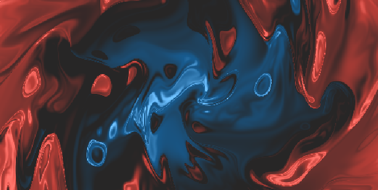 |
| vector_and_mix |  |
| voxels | 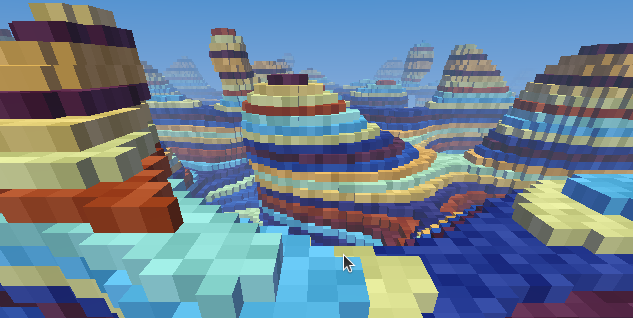 |

There's one additional shader that I played with in Defold that uses the texture sampler:

- rainbow:

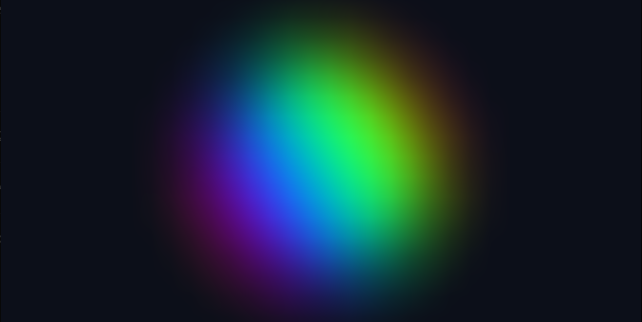

## License

MIT (shaders used in the examples have their own licenses)

## Author

Paweł Jarosz 2026

---