# DeFragCoord

This is a simple FragCoord - Defold migration guide.

You can test your shaders in [FragCoord.xyz](https://fragcoord.xyz/) online tool by XorDev and then use them in Defold. In Defold 1.12.3 and newer, engine time can now come directly from the material via `CONSTANT_TYPE_TIME`.

## Guide

The whole migration is mostly based on adjusting to the different naming used in FragCoord shaders (hence the defines). It is not perfect, but it should work with most shaders from there. In Defold 1.12.3+, you no longer need to push time manually from script. You need to:

1. Paste this fragment on top of your Defold fragment program:

```glsl
#version 140

in mediump vec2 var_texcoord0;

out vec4 out_fragColor;

uniform mediump sampler2D texture_sampler;
uniform fs_uniforms
{
    vec4 time;
    mediump vec4 res_scroll;
    mediump vec4 mouse;
};

#define u_time time.x
#define u_dt time.y
#define u_resolution res_scroll.xy
#define u_scroll res_scroll.z
#define u_mouse mouse
#define fragColor out_fragColor

// ------------------------------------------------------
// Put your FragCoord.xyz shader below:
// ------------------------------------------------------
```

2. And below paste the content of the `Main` pass from FragCoord. e.g. this is a blank project:

```glsl
void main()
{
    //Normalized screen uvs [0, 1]
    vec2 uv = gl_FragCoord.xy / u_resolution;
    //Centered, fit screen coordinates
    vec2 fit = 0.5 + (gl_FragCoord.xy - 0.5 * u_resolution) / min(u_resolution.x, u_resolution.y);

    //Output for demo
    fragColor = vec4(fit, 0, 1);
}
```

3. Then set the material constants to match the block:

- `time` as `CONSTANT_TYPE_TIME`
- `res_scroll` as `CONSTANT_TYPE_USER`
- `mouse` as `CONSTANT_TYPE_USER`
- `tint` as `CONSTANT_TYPE_USER` when your shader uses it

`time.x` is the time since engine start and `time.y` is the frame `dt`, so the defines above expose those as `u_time` and `u_dt`.

Example script that provides resolution, mouse scroll and position is provided in `main/uniforms.script` in this repository. Time and `dt` now come from the engine through the material.

## Examples

This example comes with few shaders already ported. Those are added to the sprite component. You can run it from Defold and change the material to any other one, save and Hot Reload (<kbd>Ctrl</kbd>+<kbd>R</kbd>) to quickly preview the others.

| Name | Preview |
|-|-|
| blank | 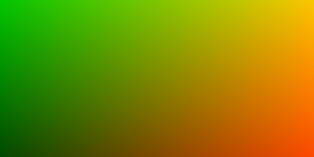 |
| cloud | 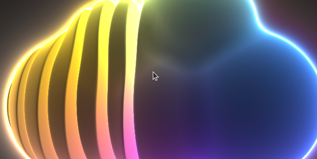 |
| corridor | 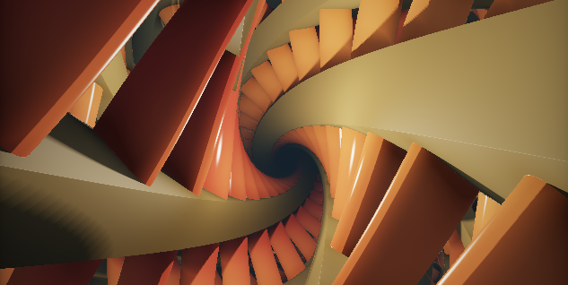 |
| dda | 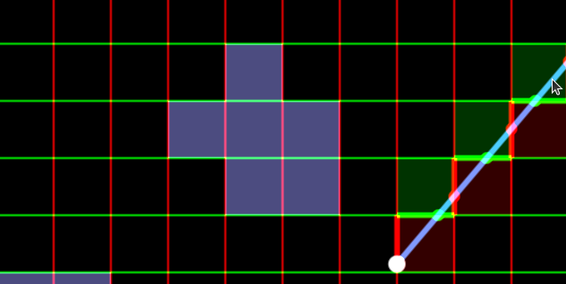 |
| dot_noise | 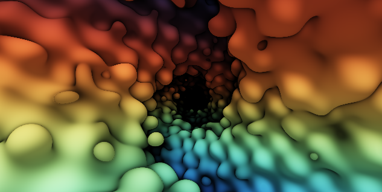 |
| four_antialiasings | 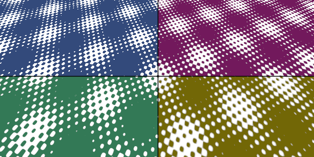 |
| light_cave | 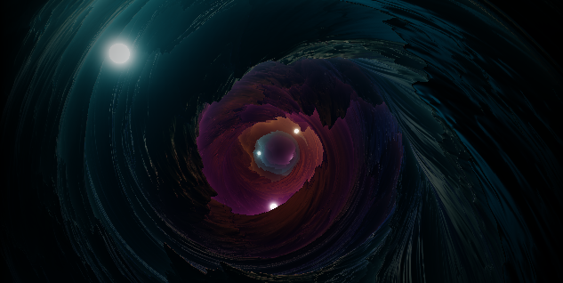 |
| nova | 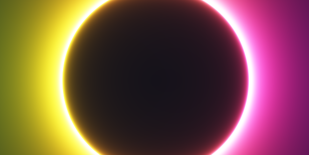 |
| pillar | 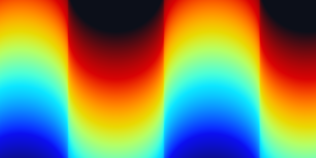 |
| sunset | 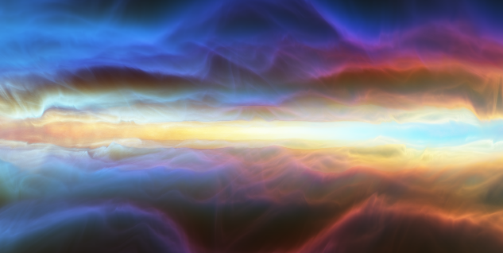 |
| the_card_game | 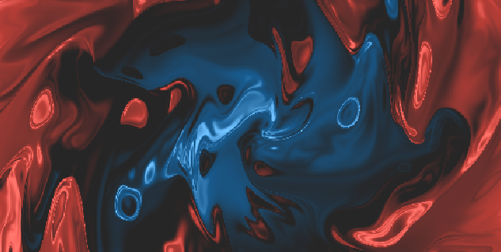 |
| vector_and_mix |  |
| voxels | 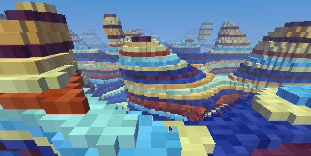 |

There's one additional shader that I played with in Defold that uses the texture sampler:

- rainbow:

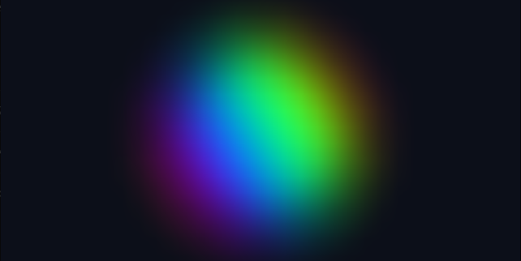

## License

MIT (shaders used in the examples have their own licenses)

## Author

Paweł Jarosz 2026

---
